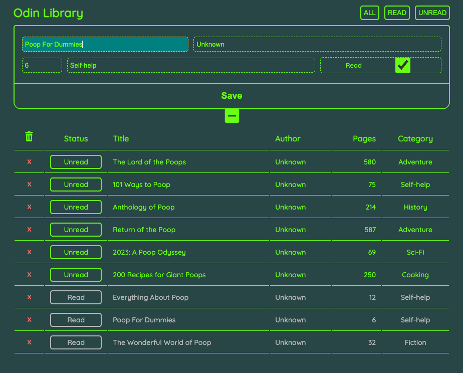

# odin-library

**LIVE DEMO: https://olzcodes.github.io/odin-library/**

The aim of this project was to create a small library (reading log) app.

https://www.theodinproject.com/lessons/node-path-javascript-library

## Screenshots

Screenshot on mobile screen (default theme)

Screenshot on larger screen (alternative theme + input form open)

## Extra Features

The features below were outside of the project scope but I wanted to build them anyway.

- Auto-capitalize text inputs.
- Basic input validation.
- Ability to edit entries.
- Automatically store data locally (in browser) using Web Storage API.
- Ability to filter list of books by read / unread.
- Ability to toggle between themes (accessible by clicking the logo).

## What I learned from this project

- How to use a constructor function to create new objects.
- How to use the Web Storage API to store and access data in the browser's memory.
- How to associate HTML elements with objects using unique identifiers.
- How to use the unique identifiers to retrieve and edit specific objects.
- Standard practice for setting up themes in CSS and JavaScript.
